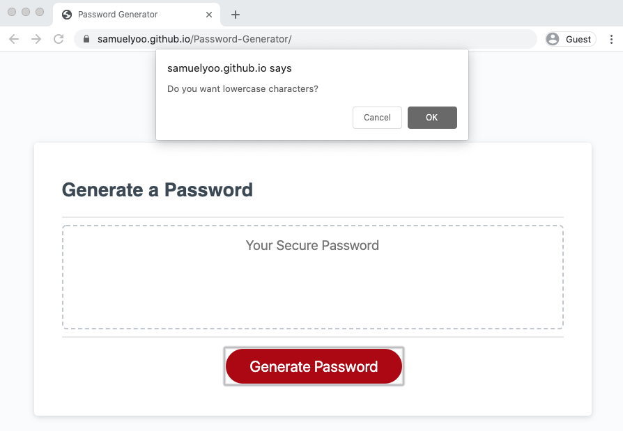

# Password-Generator

### Abstract

This application is a simple password generating tool based on user-selected criteria. 
The application will ask criteria to add lowercase letters, uppercase letters, numbers, and special characters. and then it ask to specify the length of password between 8 to 128. 

### Screen Shot

##### Desktop View

##### Phone View

### Installation
To use this app you can click : [here](https://samuelyoo.github.io/Password-Generator/index.html)

### Usage
When user click the generate password button, then the application will have alerts pop up on the page , please follow the alerts (clicking ok means yes to the prompt) and then enter the desired password length.
Finally, the secure password will display in the text box.

#### Contact
Email: sam.hc.yoo@gmail.com

LinkedIn: [LinkedIn](https://www.linkedin.com/in/samuel-hc-yoo)

#### credits
The HTML and CSS was provided by [Triology Education Services, a 2U, Inc. brand]

#### Licence
MIT license
copy right (c) Samuel Yoo
